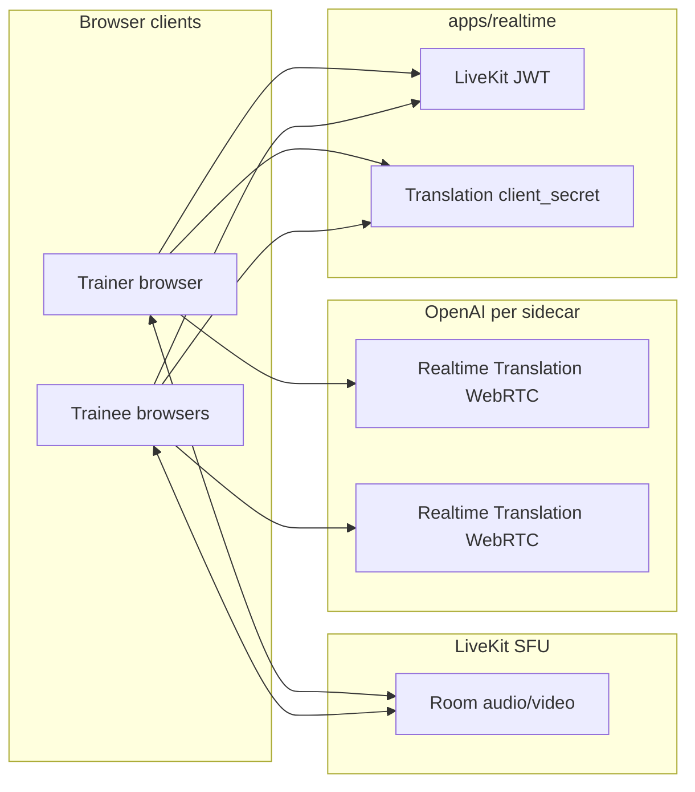

# Architecture: LiveKit + OpenAI Realtime Translation

This repo follows the **[OpenAI cookbook LiveKit translation demo](https://github.com/openai/openai-cookbook/tree/main/examples/voice_solutions/realtime_translation_guide/livekit-translation-demo)**:

## SFU: LiveKit

- **Media path:** WebRTC to LiveKit Cloud (or self-hosted). One publisher/subscriber mesh avoided: each client talks to the SFU.
- **Roles:** Implemented as display names (`Trainer (trainer)` / `Name (trainee)`); LiveKit permissions are symmetric (`canPublish`, `canSubscribe`) for the classroom MVP.

## Token flow

1. Browser calls `GET /api/livekit/token?roomName=&participantName=` on **`apps/realtime`** (default `http://127.0.0.1:8787`), implemented in [`apps/realtime/src/index.ts`](apps/realtime/src/index.ts).
2. Service returns `{ serverUrl, roomName, participantName, participantToken }` using [`livekit-server-sdk`](https://docs.livekit.io/) `AccessToken`.
3. In local dev, **`apps/web`** (Vite) proxies `/api/*` to the realtime service (see [`apps/web/vite.config.ts`](apps/web/vite.config.ts)).

## Translation flow (OpenAI)

1. For each **remote** microphone track to interpret, the browser opens an **`RTCPeerConnection`** to OpenAI Realtime Translation (`/v1/realtime/translations/calls`) after obtaining a short-lived **`client_secret`** from `POST /api/realtime/translation-token` (same realtime service; uses `OPENAI_API_KEY` only on the server).
2. Translated **audio** is played locally (`HTMLAudioElement`); it is **not** republished into the LiveKit room (same as the cookbook).

## Concurrency cap

To limit simultaneous OpenAI sessions (cost + browser CPU), the UI enables at most **six** concurrent translation sidecars; see `MAX_CONCURRENT_TRANSLATIONS` in [`apps/web/src/components/TrainingRoom.tsx`](apps/web/src/components/TrainingRoom.tsx).

## Production split

You can host **`apps/realtime`** on a small Node host and set `VITE_REALTIME_URL` in the web build to that origin (CORS must allow the web origin). The browser will call translation-token and LiveKit token endpoints on that host instead of the Vite dev proxy.
